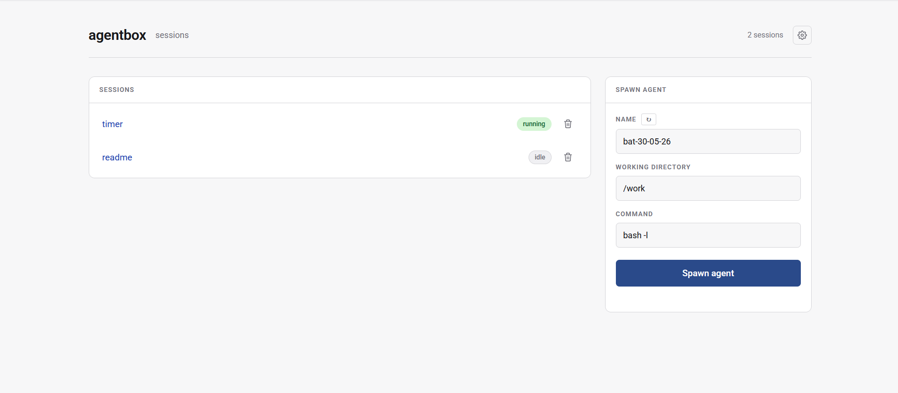

# agentbox

<div align="center">
  
</div>

A sandboxed Linux container with a browser-based tmux control plane. Spawn,
attach to, and kill long-running terminal sessions from any browser. The
sessions survive when you close the tab. Built originally for driving Claude
Code agents from anywhere, but useful for any long-running shell workload —
builds, REPLs, training jobs, an SSH-replacement on a home server.

- **Persistent tmux sessions.** Close the browser, the work keeps running.
- **xterm.js terminal in the browser.** WebGL renderer, clickable links,
  full ANSI theme, OSC 52 clipboard forwarding through tmux.
- **Hardened by default.** Non-root user, all Linux capabilities dropped,
  no host bind-mounts, resource caps, loopback-only port publish.
- **Persistent volumes.** `/work` and `/home/dev` survive container restarts
  — caches, shell history, cloned repos, agent state.
- **Optional VCS auth.** GitHub and self-hosted GitLab are wired up
  automatically if you supply tokens.
- **Docker-in-Docker.** A sidecar `dind` daemon lets the agent run
  containers without exposing the host Docker socket.
- **Authenticated remote access.** A built-in password login (signed 24h
  cookie) or a Cloudflare Tunnel + Access setup gets you to it from anywhere
  without opening a port on your network.


## Quickstart

```sh
git clone https://github.com/Dunnings/agentbox.git
cd agentbox

# Optional: set up credentials.
cp .env.example .env
chmod 600 .env
$EDITOR .env

./agentbox        # builds the image (first run) and brings the container up
```

Open <http://127.0.0.1:9119/>. Spawn a session, click into it, you have a
terminal.

`./agentbox` keeps the image fresh by passing today's date as a build-arg
cache-buster on the `claude-code` install layer, so you pick up new releases
without forcing a full `--no-cache` rebuild.

### Choosing toolchains

Pick what gets baked into the image with `INSTALL_*` flags in `.env`. Each is
`1` (install) or `0` (skip). They're build-time flags, so re-run `./agentbox` (or
`docker compose build`) after changing them. The control plane, git, `jq`,
tmux, and the `python3` interpreter are always installed — they're the core.

**Standard toolchains — on by default** (set to `0` to slim the image down):

```sh
INSTALL_NODE=1      # Node.js 22 + npm
INSTALL_BUN=1       # Bun
INSTALL_RUST=1      # Rust (rustup, cargo) — the heaviest layer
INSTALL_DOCKER=1    # docker CLI + compose/buildx plugins
INSTALL_GH=1        # GitHub CLI
INSTALL_GLAB=1      # GitLab CLI
INSTALL_CLAUDE=1    # Claude Code (needs INSTALL_NODE=1)
INSTALL_PLAYWRIGHT=1 # headless Chromium + system libs for browser tests/screenshots (needs INSTALL_NODE=1)
```

**Extra languages & utilities — off by default** (set to `1` to add):

```sh
INSTALL_PYTHON=0    # Python dev tooling: pip + pipx + uv
INSTALL_GO=0        # Go toolchain
INSTALL_DENO=0      # Deno
INSTALL_RUBY=0      # Ruby + bundler
INSTALL_SEARCH=0    # ripgrep (rg), fd, fzf
INSTALL_YQ=0        # yq — YAML/JSON processor (companion to jq)
INSTALL_SHELLCHECK=0
INSTALL_DB_CLIENTS=0 # psql, sqlite3, redis-cli
```

**CLI AI coding agents — off by default** (set to `1` to add):

```sh
INSTALL_COPILOT=0   # GitHub Copilot CLI   (needs INSTALL_NODE=1)
INSTALL_CODEX=0     # OpenAI Codex CLI     (needs INSTALL_NODE=1)
INSTALL_GEMINI=0    # Google Gemini CLI    (needs INSTALL_NODE=1)
INSTALL_OPENCODE=0  # opencode             (needs INSTALL_NODE=1)
INSTALL_AIDER=0     # Aider                (needs INSTALL_PYTHON=1)
```

(Claude Code is `INSTALL_CLAUDE` in the standard set above.) An AI CLI whose
prerequisite is missing is skipped with a warning rather than failing the
build. Unset flags fall back to these defaults.

### Seeding files into the container

Point `SEED_HOME` and/or `SEED_WORK` at host directories in `.env` and their
contents are copied into `/home/dev` and `/work` on every start:

```sh
SEED_HOME=/home/youruser/agentbox-seed/home   # → copied into /home/dev
SEED_WORK=/home/youruser/agentbox-seed/work   # → copied into /work
```

Drop in whatever you want pre-loaded — a `.npmrc`, `.gitconfig`, `.ssh/`
contents, editor config, project scaffolding — and it shows up in the
container. The directories are mounted read-only; copies land owned by `dev`
with their permissions preserved (a `600` `.npmrc` stays `600`). It's a
sync-on-run, so seeded files overwrite their counterparts each start, while
anything not in the seed dir is left alone. Unset → skipped.

### Other entry points

```sh
./agentbox --attach     # attach to the persistent tmux session `main`
./agentbox shell        # plain bash inside the container, no tmux
./agentbox <cmd...>     # one-off command (e.g. ./agentbox tmux ls)
```

## Browser control plane

Once the container is up, the control plane is at <http://127.0.0.1:9119/>.

- Lists every tmux session in the container with attach state and window count.
- **Spawn agent** creates a new tmux session. Pick a working directory and
  one of the configured commands. The default commands are
  `claude --dangerously-skip-permissions` and `bash -l` — edit them under the
  cog menu to add your own (`bun run dev`, `python -i`, whatever).
- The name field auto-fills with `<animal>-DD-MM-YY` and skips animals
  already in use.
- Each session has a full xterm.js terminal over a WebSocket / PTY pipe —
  input, output, resize, scrollback. Multiple browser tabs can attach to
  the same session simultaneously.

The port is published on `127.0.0.1` only (`docker-compose.yml`), so nothing
on the LAN can reach it directly.

## Remote access with Cloudflare Tunnel + Access

This gives you authenticated public access without opening any inbound ports
on your network. You need a domain on Cloudflare (free plan is fine). There
are two ways to run the tunnel — the built-in sidecar is the easy one.

### Easiest: the built-in tunnel sidecar (just a token)

agentbox ships a `cloudflared` sidecar that connects a Cloudflare
[remotely-managed tunnel](https://developers.cloudflare.com/cloudflare-one/connections/connect-networks/get-started/create-remote-tunnel/).
You don't install `cloudflared` on the host or write any config — you paste one
token and everything else lives in the Cloudflare dashboard.

1. **Create the tunnel.** Cloudflare **Zero Trust → Networks → Tunnels → Create
   a tunnel → Cloudflared**. Name it (e.g. `agentbox`) and copy the **tunnel
   token** it shows you (a long `eyJ...` string).
2. **Add a public hostname** to that tunnel: pick `agentbox.your.domain`, and set
   the service to **`http://agentbox:9119`** — that's the control plane on the
   internal compose network (not `127.0.0.1`, since the sidecar reaches it
   container-to-container).
3. **Drop the token in `.env`** and bring agentbox up:

   ```sh
   CLOUDFLARE_TUNNEL_TOKEN=eyJ...        # in .env
   ./agentbox
   ```

   `./agentbox` sees the token and starts the `cloudflared` sidecar automatically
   (it enables the compose `tunnel` profile). WebSockets work out of the box.

Now jump to [Lock it down with Cloudflare Access](#lock-it-down-with-cloudflare-access)
— a tunnel alone is publicly reachable.

### Alternative: run cloudflared yourself on the host

If you already run `cloudflared` on the host (as a system service, in another
container, etc.), skip the sidecar — just leave `CLOUDFLARE_TUNNEL_TOKEN`
unset and point your tunnel's ingress at the published port,
`http://127.0.0.1:9119`. A locally-managed `config.yml` ingress looks like:

```yaml
ingress:
  - hostname: agentbox.your.domain
    service: http://127.0.0.1:9119
  - service: http_status:404
```

### Lock it down — a tunnel alone is publicly reachable

The tunnel makes the control plane reachable by anyone with the URL, and once
you're in you can run arbitrary commands as the `dev` user. So put auth in
front of it. Two options:

#### Built-in password login (simplest)

Set `AGENTBOX_PASSWORD` in `.env` to a long, random value and agentbox shows a login
page that gates everything — pages, the API, and the terminal WebSocket:

```sh
AGENTBOX_PASSWORD=use-a-long-random-string   # in .env
```

A correct password issues an HMAC-signed, `HttpOnly` cookie that lasts 24h
(the password is never stored in the cookie; changing it logs everyone out).
Visit `/logout` to clear it. Leave `AGENTBOX_PASSWORD` empty to disable the login
entirely and rely on your proxy instead. This is a single shared secret with
no per-user identity or MFA — fine for personal use behind HTTPS with a strong
password; use Cloudflare Access below if you want more.

#### Cloudflare Access (stronger)

[Cloudflare Access](https://developers.cloudflare.com/cloudflare-one/applications/configure-apps/self-hosted-public-app/)
authenticates at the edge before traffic ever reaches agentbox, with real identity
(email OTP, your IDP, groups, service tokens, mTLS). In the dashboard:

1. **Zero Trust → Access → Applications → Add an application →
   Self-hosted.**
2. Application name: `agentbox`. Application domain: `agentbox.your.domain`.
3. **Add policy → Allow.** For the simplest "just me" setup, set the
   selector to **Emails** and add your email — Cloudflare sends a one-time PIN
   on each new device, no external IDP needed.
4. Save. Visit `https://agentbox.your.domain` — Access challenges you, then drops
   you into the control plane.

You can use both: Access at the edge and `AGENTBOX_PASSWORD` as a second factor.

## Running Docker inside agentbox

`docker`, `docker compose`, and `docker buildx` are installed in the
agentbox image and `DOCKER_HOST=tcp://dind:2375` is set automatically.
Commands inside agentbox talk to a **sidecar** Docker daemon (`dind` service
in `docker-compose.yml`), not to the host:

```sh
./agentbox shell
docker run --rm hello-world
docker compose up        # from any cloned repo in /work
```

Why a sidecar and not the host socket:

- Anything you launch (images, containers, volumes) lives **inside the dind
  container's** `/var/lib/docker`, not on the host daemon. The host's
  containers and images stay invisible and untouchable from agentbox.
- A compromised agentbox can't trivially escape to the host by launching a
  privileged container with `-v /:/host` — the daemon it talks to has no
  view of the host filesystem.
- agentbox itself stays unprivileged and capability-dropped. Only the dind
  sidecar is privileged, and it's reachable only over the internal compose
  network (TCP 2375 is **not** published to localhost or the LAN).

State lives in the `agentbox-dind-data` volume — wipe it with
`docker volume rm agentbox-dind-data` if you want a clean inner daemon.

`docker buildx` and BuildKit work out of the box. Cross-platform builds
need an extra `binfmt` setup inside dind (the standard
`docker run --privileged --rm tonistiigi/binfmt --install all` recipe,
launched against the sidecar) — not done automatically.

## Architecture

```
Cloudflare edge ──► tunnel ──┐  (optional, remotely-managed)
host                         │
└── docker                   │
    ├── agentbox-cloudflared ◄───┘  (optional sidecar; profile "tunnel")
    │       └── ──► http://agentbox:9119 (internal network)
    │
    ├── agentbox (one container)        ◄── 127.0.0.1:9119 (local access)
    │   ├── tini → entrypoint.sh
    │   │   ├── controlplane supervisor (bash)
    │   │   │   └── uvicorn + FastAPI
    │   │   │       ├── HTTP   /, /api/*, /t/<name>
    │   │   │       └── WS     /ws/<name>  ─► pty.fork → tmux attach
    │   │   └── sleep infinity (PID 1's child)
    │   └── tmux server (persistent across attaches)
    │       ├── session: kangaroo-10-05-26  (claude)
    │       ├── session: panda-10-05-26     (bash)
    │       └── ...
    │
    │   docker / docker compose ──► tcp://dind:2375 (internal network only)
    │
    └── agentbox-dind (privileged sidecar)
        └── dockerd → its own /var/lib/docker volume
            └── containers launched from agentbox live here
```

### Volumes

- `agentbox-work` → `/work` — clone repos here.
- `agentbox-home` → `/home/dev` — `.npm`, `.cargo`, `.bun`, `.claude`,
  bash history.
- `agentbox-dind-data` → `/var/lib/docker` in the dind sidecar — image
  cache, containers, and named volumes created from agentbox.

`/tmp` is tmpfs and wiped on container restart, which kills the tmux server
along with it. The control plane's supervisor loop restarts only the FastAPI
process on crash, so a bad request never costs you your sessions — only a
full container restart does.

## Security model

The container hardening is defense-in-depth, not the primary boundary. The
real boundary is **what credentials you put into the container**. Keep them
tightly scoped:

- Use a dedicated bot user / fine-grained PAT, not your personal token.
- Minimum scopes for the work you actually want to do.
- Protect `main` / require PR review on the host so a misbehaving session
  can't merge bad code on its own.

Container hardening:

- Runs as `dev` (UID 1000), not root.
- `cap_drop: ["ALL"]`, `no-new-privileges: true`, no privileged mode.
- The **host** Docker socket is never mounted, and there are no host
  filesystem bind-mounts by default — Docker access goes through the sidecar,
  and secrets come in as env vars. The only optional mounts are the read-only
  seed directories you explicitly opt into (`SEED_HOME` / `SEED_WORK`).
- Resource caps: pids, memory, CPU, file descriptors.
- Control plane port published on `127.0.0.1` only; remote access is gated by
  the built-in password login (`AGENTBOX_PASSWORD`), Cloudflare Access, or whatever
  auth proxy you put in front. The password login throttles repeated failures
  (growing per-IP delay) to slow online guessing.
- Control-plane responses carry hardening headers — a same-origin
  `Content-Security-Policy`, `X-Frame-Options: DENY` (no framing/clickjacking of
  a UI that runs commands), `X-Content-Type-Options: nosniff`, and a
  `no-referrer` policy. Session names are rendered as text, never interpolated
  into HTML, so a name set outside the API can't inject script.

The dind sidecar **is** privileged — that's how dockerd-in-docker works —
but it sits behind an internal compose network with no published port,
runs its own kernel-mediated dockerd, and uses a dedicated volume for
storage. Containers launched from agentbox can do anything dockerd can do
inside that sidecar (including --privileged, including mounting `/`),
but `/` there is the sidecar's filesystem, not the host's. Don't trust
the sidecar with secrets you wouldn't trust agentbox with.

## Files

| Path | Purpose |
|------|---------|
| `image/Dockerfile` | Debian 12 base + Python venv for the control plane; toolchains, utilities, and CLI AI agents (Claude Code, Copilot, Codex, Gemini, opencode, Aider) toggled via `INSTALL_*` build args — see [Choosing toolchains](#choosing-toolchains) |
| `docker-compose.yml` | Hardening, volumes, resource limits, loopback port publish, dind sidecar, optional cloudflared tunnel sidecar |
| `image/entrypoint.sh` | Wires up optional GitHub/GitLab credentials from `.env`, backgrounds the control plane with auto-restart |
| `agentbox` | Build (with daily cache-bust), bring container up; `--attach` to drop into tmux |
| `image/CLAUDE.md` | In-container `CLAUDE.md` — describes the sandbox to Claude Code if you use it |
| `image/controlplane/server.py` | FastAPI app: tmux list/spawn/kill + WebSocket-PTY terminal |
| `image/controlplane/test_server.py` | Unit tests for auth tokens, redirect safety, name validation, security headers, login throttle |
| `image/controlplane/static/index.html` | Sessions list + spawn form |
| `image/controlplane/static/terminal.html` | xterm.js terminal page |
| `image/controlplane/static/settings.js` | Theme / zoom / configurable command list (stored in localStorage) |
| `.env.example` | Template — copy to `.env` and fill in (everything optional) |

## License

MIT — see [LICENSE](LICENSE).
